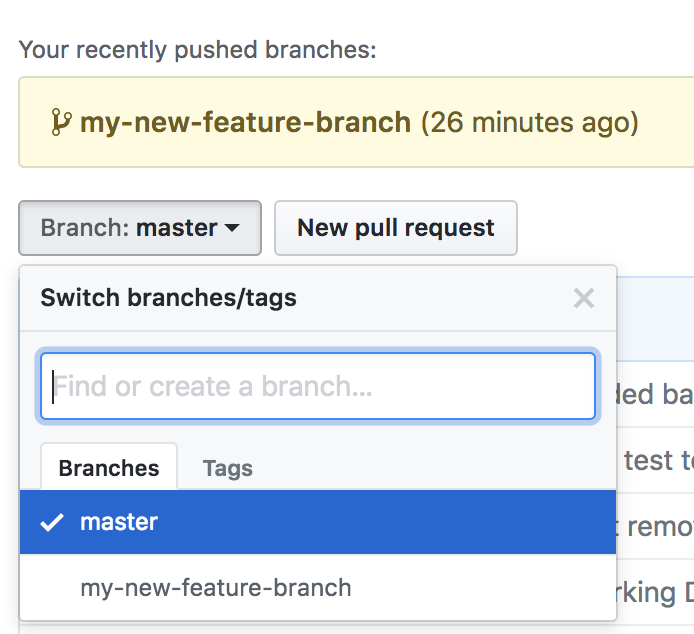
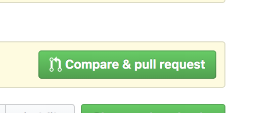
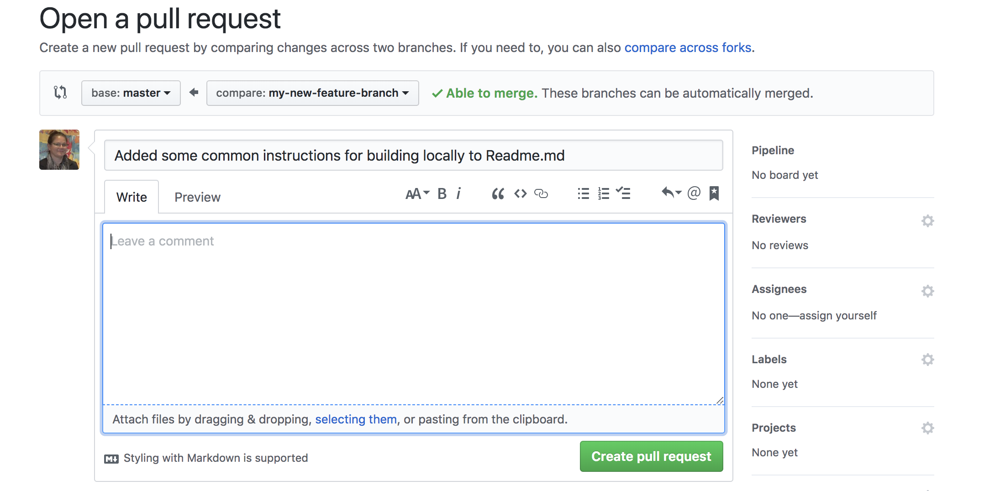

# BudBlocks Composer

This directory contains the files for launching the blockchain network, and for defining the composer model files and generating the .bna (business network archive) for BudBlocks


## Contributing to this repository


## Commands for manually running the network and the composer rest-server locally

### Restart local blockchain network
To restart the local blockchain network

### Upgrade chain-code
After someone has made changes, and assuming that they have upgraded the composer version, the following process to manually install and instantiate the new business network archive:

```
# pull most recent changes to your local clone
git pull origin master

# create a new business archive, which generates the chaincode
composer archive create -t dir -n .

# install the newly generated business archive, replaceing <version> with the updated version (must match the version in package.json)
composer network install -a budblocks-network@<version>.bna -c peeradmin@hlfv1

# Install the chain-code
# The first time that you instantiate the chaincode after you have restarted the blockchain network, then you should use the composer network start command, replacing <version> with the updated version from package.json
composer network start --networkName budblocks-network --networkVersion <version>  --c PeerAdmin@hlfv1 -A admin -S adminpw
# To upgrade the chain-code of a running blockchain network, use the composer network upgrade command:
composer network upgrade -c peeradmin@hlfv1 -n budblocks-network -V <version>

# Instantiate the chain-code (on the default channel), repacing <version> with the updated version from package.json
composer network install -a budblocks-network@<version>.bna -c peeradmin@hlfv1
composer-rest-server -c admin@budblocks-network -p 3000
```

## Deploying BudBlocks to IBM Cloud
[Setup Toolchain](https://console.bluemix.net/devops/setup/deploy/?repository=https%3A//github.com/BudBlocks/Composer.git&branch=restructureForCloud&env_id=ibm%3Ayp%3Aus-south&deploy-region=ibm%3Ayp%3Aus-south)
### Git Instructions for branching and creating pull requests
[This page](https://gist.github.com/blackfalcon/8428401) has great directions for this.
To branch and submit a pull request

see which branch you are on
```
git branch
```
change back to master branch
```
git checkout master
```
see which branch you are on
```
git branch
```
create a new branch from master branch, and set your working directory to that branch
```
git checkout -b my-new-feature-branch master
```
see which branch you are on
```
git branch
```
Make your changes, test your changes.  But commit often.  You should be committing several times a day if not hour.

See what files you have changed
```
git status
```

Selective add a file
```
git add <filename>
```

Or add all changed files

```
git add .
```

Make sure everything looks ok
```
git status
```
Checkin to your local repository
```
git commit -m "Your message Goes Here"
```
Push your branch to the remote repository
```
git push origin my-new-feature-branch
```
Make sure your branch is in sync with the latest changes:
```
git pull origin my-new-feature-branch
```
Tracking remote branches
```
git branch -r
```
keep local repo in sync with deleted remote branches
```
git fetch -p
```

Finally you are ready for the pull request. **You MUST DO THIS FROM THE GITHUB UI **





#### Merging the code

Make sure you have the latest version of the feature branch from the remote repository

```
git checkout my-new-feature-branch
git pull origin my-new-feature-branch
```
Make sure that the feature branch is up to date with the master.  If there are conflicts, address them here!
```
git pull origin master
```
merge branches
```
git checkout master
git pull origin master
git merge --no-ff my-new-feature-branch
```
This may throw you into vi.  Type <esc> and then :wq

Now that you have merged the code, the feature branch definition is obsolete, so delete it  from local and remote repo.

```
git branch -d my-new-feature-branch
git push origin --delete my-new-feature-branch
```
